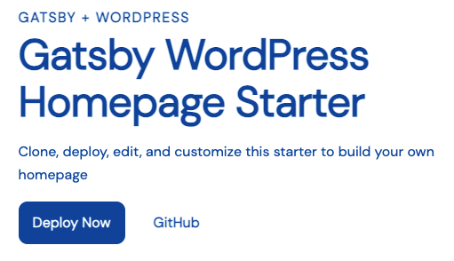

<a href="https://www.gatsbyjs.com">
  
</a>

# Gatsby Starter WordPress Homepage

Create a homepage using Gatsby and WordPress. This starter demonstrates how to use WordPress to build a homepage and can be customized to match your own visual branding.

[View the Demo](https://gatsbywordpresshomepage.gatsbyjs.io/)

**Note:**
This version of the WordPress homepage starter is written in JavaScript. If you want to use WordPress but TypeScript is more your style, there is also a TypeScript version maintained on [GitHub](https://github.com/gatsbyjs/gatsby-starter-wordpress-homepage-ts).

## Quick start

You will need a new or existing WordPress instance to use this starter.
This starter requires the following plugins to be installed in your WordPress instance:

- [WPGatsby][]
- [WPGraphQL][]
- [Advanced Custom Fields][]
- [WPGraphQL for Advanced Custom Fields][]

Once these plugins are installed, you'll need the URL of the GraphQL endpoint for configuration.

[wpgatsby]: https://wordpress.org/plugins/wp-gatsby/
[wpgraphql]: https://wordpress.org/plugins/wp-graphql/
[advanced custom fields]: https://wordpress.org/plugins/advanced-custom-fields/
[wpgraphql for advanced custom fields]: https://github.com/wp-graphql/wp-graphql-acf

1. **Create a Gatsby site**

   Use the Gatsby CLI to get started locally:

   ```sh repo
   npx gatsby new my-homepage https://github.com/gatsbyjs/gatsby-starter-wordpress-homepage
   ```

1. **Import content to your WordPress instance**

   - In your WordPress Admin, navigate to _Custom Fields_ > _Tools_ and upload the `data/acf-field-groups.json` file in the _Import Field Groups_ form and click _Import File_.
   - Under _Pages_, create a new page called "Homepage."
   - Ensure that the Homepage imported into WordPress is set to be your site's "Homepage" by going to _Settings_ > _Reading_ and setting the _Your homepage displays_ field to _A static page_ and select _Homepage_ from the dropdown.
   - Navigate back to the Homepage, where you should see the custom field groups for the homepage and you can add your own content.
   - Finally, go to _GraphQL_ > _Settings_ and copy the endpoint for the GraphQL API (e.g. https://example.com/graphql) and create a `.env` file with `WPGRAPHQL_URL="<your-graphql-endpoint-url>"`.

1. **Start developing**

   In your site directory, start the development server:

   ```sh
   yarn start
   ```

   Your site should now be running at <http://localhost:8000>

1. **Open the source code and start editing**

## Deploy your site

Once your content is available in WordPress, deploy your site to [Gatsby Cloud](https://gatsbyjs.com/products/cloud):

1. Push your local site to a new repo in either GitHub, GitLab, or Bitbucket
1. Log into your [Gatsby Cloud Dashboard][] and click on **Add a site**
1. Use the **Import from a Git repository** option to find your site
1. Add the environment variables from your `.env.production` file to Gatsby Cloud during setup
1. Click **Build site** and your site should start building

For a more detailed walkthrough, see the tutorial on how to [build your site with Gatsby Cloud][tutorial].

[gatsby cloud dashboard]: https://gatsbyjs.com/dashboard
[tutorial]: https://www.gatsbyjs.com/docs/tutorial/part-1/#build-your-site-with-gatsby-cloud

### Deploy without using the CLI

Alternatively, you can deploy this starter directly to Gatsby Cloud.
Note that you will need to set up your content in WordPress manually.

[](https://www.gatsbyjs.com/dashboard/deploynow?url=https://github.com/gatsbyjs/gatsby-starter-wordpress-homepage)

## Setting up Gatsby Cloud Preview

To use Gatsby Cloud Preview with this site, see the documentation for
[Setting up Preview with WPGatsby][].

[setting up preview with wpgatsby]: https://github.com/gatsbyjs/gatsby/blob/master/packages/gatsby-source-wordpress/docs/tutorials/configuring-wp-gatsby.md#setting-up-preview

## What's included?

```sh
├── README.md
├── gatsby-config.js
├── gatsby-node.js
├── src
│   ├── components
│   ├── pages
│   ├── colors.css.ts
│   ├── styles.css.ts
│   └── theme.css.ts
└── .env.EXAMPLE
```

1. **`gatsby-config.js`**: [Gatsby config][] file that includes plugins required for this starter.
1. **`gatsby-node.js`**: [Gatsby Node][] config file that creates an abstract data model for the homepage content.
1. **`src/`**: The source directory for the starter, including pages, components, and [Vanilla Extract][] files for styling.

[gatsby config]: https://www.gatsbyjs.com/docs/reference/config-files/gatsby-config/
[gatsby node]: https://www.gatsbyjs.com/docs/reference/config-files/gatsby-node/
[vanilla extract]: https://vanilla-extract.style/

## How to

### Update the color theme

To update the colors used in this starter, edit the `src/colors.css.ts` file.

```.ts
// src/colors.css.ts
export const colors = {
  background: "#fff",
  text: "#004ca3",
  primary: "#004ca3",
  muted: "#f5fcff",
  active: "#001d3d",
  black: "#000",
}

```

If you'd like to add additional colors, add additional keys to this object.
This file is imported into `src/theme.css.ts` and creates CSS custom properties, that can be imported and used in other `.css.ts` files.

The UI components file `src/components/ui.js` imports styles from `src/components/ui.css.ts`. You can see how the theme and color values are being used in this file.

### Add your logo


Replace the `src/components/brand-logo.js` component with your own brand logo.
If you have an SVG version, it can be rendered inline as a React component, following the example in this file. Note that SVG attributes will need to be camel cased for JSX.

Using an inline SVG for the logo allows it to pick up the colors used in CSS, which is how the logo colors are inverted for the mobile menu.

If you prefer to use an image, use the [`StaticImage`](https://www.gatsbyjs.com/docs/reference/built-in-components/gatsby-plugin-image/#staticimage) component from `gatsby-plugin-image` in place of the SVG in this file.

### Customize headings, buttons, and other styles



To further customize the look and feel of the homepage, edit the UI components in `src/components/ui.js` and styles in `src/components/ui.css.ts`.

### Customize section components

To customize any of the sections of the homepage, edit the relevant component in `src/components`.
Most of the styles for these components are handled with shared UI components in `src/components/ui.js`.

### Create custom section components

To create a new type of section in your homepage, you'll want to create a new section component, using the existing components as an example.
For this example, we'll create a new "Banner" component.

1. First, update your custom fields in WordPress to support the new component

   Under the _Custom Fields_ tab, create a new _Field Group_ and call it "Homepage Banner."
   For this example, add two text fields: `banner_heading` and `banner_text`.
   In the _Location_ rules, be sure to show the field group in _Page_ post types.
   Also ensure that the _Show in GraphQL_ option is enabled for this field.

   Navigate to the _Pages_ tab and edit the Homepage and add content for the new Banner component.

1. Update `gatsby-node.js`

   Edit your site's `gatsby-node.js` file, adding a type for `HomepageBanner` that matches your custom fields in WordPress.
   This allows the homepage to query the abstract `HomepageBanner` type.

   ```js
   // in gatsby-node.js
   exports.createSchemaCustomization = async ({ actions }) => {
     // ...
     actions.createTypes(`
       type HomepageBanner implements Node & HomepageBlock {
         id: ID!
         blocktype: String
         heading: String
         text: String
       }
     `)
     // ...
   }
   // ...
   exports.onCreateNode = ({ actions, node, createNodeId, createContentDigest }) => {
   }
     // ...
     switch (node.internal.type) {
       case "WpPage":
         if (node.slug !== "homepage") return
         const {
           homepageHero,
           homepageCta,
           statList,
           testimonialList,
           productList,
           logoList,
           featureList,
           benefitList,
           // add the new custom field group here
           homepageBanner,
         } = node

         const heroID = createNodeId(`${node.id} >>> HomepageHero`)
         // create an node id for the field group
         const bannerID = createNodeId(`${node.id} >>> HomepageBanner`)
         // ...

         // create a new node for this field group
         actions.createNode({
           id: bannerID,
           internal: {
             type: "HomepageBanner",
             contentDigest: createContentDigest(JSON.stringify(homepageBanner)),
           },
           parent: node.id,
           blocktype: "HomepageBanner",
           heading: homepageBanner.bannerHeading,
           text: homepageBanner.bannerText,
         })
         // ...
         actions.createNode({
           ...node,
           id: createNodeId(`${node.id} >>> Homepage`),
           internal: {
             type: "Homepage",
             contentDigest: node.internal.contentDigest,
           },
           parent: node.id,
           blocktype: "Homepage",
           image: node.featuredImageId,
           content: [
             heroID,
             logosID,
             // add your banner content in the postion you would like it to appear on the page
             bannerID,
             productsID,
             featuresID,
             benefitsID,
             statsID,
             testimonialsID,
             ctaID,
           ],
         })
         // ...
     }
   }
   ```

1. Next, create the Banner component:

   ```jsx fileExt
   // src/components/banner.js
   import * as React from "react"
   import { graphql } from "gatsby"
   import { Section, Container, Heading, Text } from "./ui"

   export default function Banner(props) {
     return (
       <Section>
         <Container>
           <Heading>{props.heading}</Heading>
           <Text>{props.text}</Text>
         </Container>
       </Section>
     )
   }

   export const query = graphql`
     fragment HomepageBannerContent on HomepageBanner {
       id
       heading
       text
     }
   `
   ```

1. Export the component from `src/components/sections.js`

   ```js fileExt
   // src/components/sections.js
   export { default as HomepageHero } from "./hero"
   export { default as HomepageFeature } from "./feature"
   export { default as HomepageFeatureList } from "./feature-list"
   export { default as HomepageLogoList } from "./logo-list"
   export { default as HomepageBenefitList } from "./benefit-list"
   export { default as HomepageTestimonialList } from "./testimonial-list"
   export { default as HomepageStatList } from "./stat-list"
   export { default as HomepageCta } from "./cta"
   export { default as HomepageProductList } from "./product-list"

   // add export for new component
   export { default as HomepageBanner } from "./banner"
   ```

1. Add the GraphQL query fragment to the query in `src/pages/index.js`

   ```js fileExt
   // in src/pages/index.js
   export const query = graphql`
     {
       homepage {
         id
         title
         description
         image {
           id
           url
         }
         blocks: content {
           id
           blocktype
           ...HomepageHeroContent
           ...HomepageFeatureContent
           ...HomepageFeatureListContent
           ...HomepageCtaContent
           ...HomepageLogoListContent
           ...HomepageTestimonialListContent
           ...HomepageBenefitListContent
           ...HomepageStatListContent
           ...HomepageProductListContent
           # New component fragment
           ...HomepageBannerContent
         }
       }
     }
   `
   ```

## Troubleshooting

### Errors after making changes to the schema

If you've made changes to the `gatsby-node.js` file or changes to the WordPress data model, clear the Gatsby cache before running the develop server:

```sh
yarn clean && yarn start
```

---

## 🎓 Learning Gatsby

Looking for more guidance? Full documentation for Gatsby lives [on the website](https://www.gatsbyjs.com/). Here are some places to start:

- **For most developers, we recommend starting with our [in-depth tutorial for creating a site with Gatsby](https://www.gatsbyjs.com/tutorial/).** It starts with zero assumptions about your level of ability and walks through every step of the process.
- **To dive straight into code samples, head [to our documentation](https://www.gatsbyjs.com/docs/).**

## 💫 Deploy

[Build, Deploy, and Host On The Only Cloud Built For Gatsby](https://www.gatsbyjs.com/cloud/)

Gatsby Cloud is an end-to-end cloud platform specifically built for the Gatsby framework that combines a modern developer experience with an optimized, global edge network.
